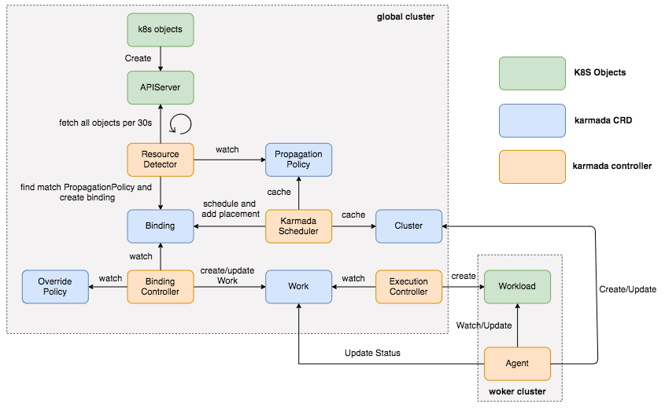

# 理解 Karmada

## 工作流程

    

1. 用户在 global 集群中创建对象
1. Resource Detector 会每30s去list集群中的所有资源，放到队列中
1. Resource Detector 会对队列中的每个对象查找匹配的 PropagationPolicy，创建 Binding
1. 此时的 Binding 中没有 targetCluster，而 Karmada Scheduler会根据 Cluster 和 PropagationPolicy 计算调度结果，填入 Binding 的 targetCluster
1. BindingController 会watch OverridePolicy和Binding，创建Work(每个cluster会有一个namespace)
1. ExecutionController watch 到 Work 对象，提取 `spec.workload` 定义的对象，然后调用 worker 集群的 client 来创建和修改对象
1. 而 worker 集群的 Agent 则同样会 watch Work 对象并同步 Workload 的状态到 Work

## Karmada优点和缺点

### 优点

1. 通过对Karmada的文档和源码分析，Karmada相对于kubefed v2的最大优点：完全兼容k8s的API。
1. 应用从单集群扩展为多集群时，不需要修改源文件，仅需要添加多集群的 manifest 包括 PropagationPolicy 和 OverridePolicy，这些文件完全可以由运维同学来添加。因此用户迁移和学习成本不大。

### 缺点

1. 单独引入一套 apiserver, controller-manager 以及 etcd，带来了额外的维护成本。
1. 要求控制层集群到管控集群必须网络可达。
1. 不支持 pull 模式的资源分发
1. karmada 创建多集群应用是在 global 集群，所以应用也会在 global 集群存在一份，会给用户带来困惑也浪费了 global 集群的资源。
1. 从 karmada 当前的设计来看存在多个controller watch 同一个资源的情况，这种情况很容易造成多个 controller 在 reconcile 同一个对象时冲突。
